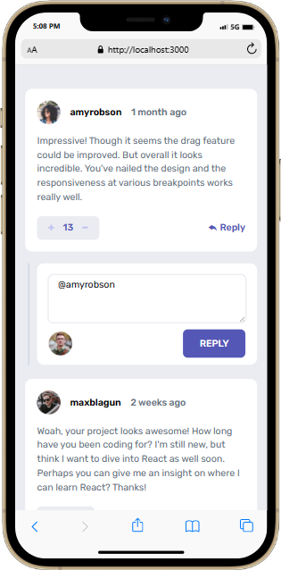
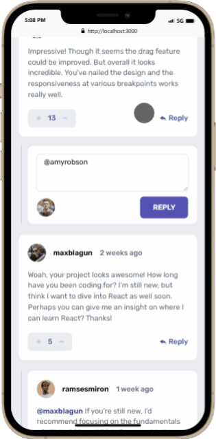

# Frontend Mentor - Interactive comments section solution

This is a solution to the [Interactive comments section challenge on Frontend Mentor](https://www.frontendmentor.io/challenges/interactive-comments-section-iG1RugEG9). Frontend Mentor challenges help you improve your coding skills by building realistic projects. 

## Table of contents

- [Overview](#overview)
  - [The challenge](#the-challenge)
  - [Screenshot](#screenshot)
  - [Links](#links)
- [My process](#my-process)
  - [Built with](#built-with)
  - [What I learned](#what-i-learned)
  - [Continued development](#continued-development)
  - [Useful resources](#useful-resources)
- [Author](#author)
- [Acknowledgments](#acknowledgments)

**Note: Delete this note and update the table of contents based on what sections you keep.**

## Overview

### The challenge

Users should be able to:

- View the optimal layout for the app depending on their device's screen size
- See hover states for all interactive elements on the page
- Create, Read, Update, and Delete comments and replies
- Upvote and downvote comments
- **Bonus**: If you're building a purely front-end project, use `localStorage` to save the current state in the browser that persists when the browser is refreshed.
- **Bonus**: Instead of using the `createdAt` strings from the `data.json` file, try using timestamps and dynamically track the time since the comment or reply was posted.

### Screenshot

#### mobile view

---
.png)
---


#### desktop view
.png)

.png)

.png)


### Links

- Solution URL: [Frontend Mentor solution URL](https://www.frontendmentor.io/solutions/responsive-interactive-comment-section-90I7LkU_Ag)
- Live Site URL: [Live site URL](https://interactive-comments-section-victory.vercel.app)

## My process

### Built with

- Semantic HTML5 markup
- Tailwind CSS
- CSS custom properties
- Flexbox
- Mobile-first workflow
- Vanilla JavaScript
- SCSS
- GULP


### What I learned

I learnt alot of things here, from learnign how to calculate space between elements to controlling the cursor and positioning it in the textarea. A whole lot more tho.


```js
const getSpaceBetweenElements = (commentIndex) => {
    let element1;
    let element2;
    let spaceBetweenElements;
    let length = commentData.comments.length

    setTimeout(() => {
        commentData.comments.forEach((comment, i) => {
          const { replies } = comment
          if (replies.length == 0) {
            length--
          }
        })
        const lines = Array.from(document.querySelectorAll('.line'))
        element1 = document.getElementById(`${commentIndex}`);
        if (commentIndex !== commentData.comments.length - 1) {
          element2 = element1.parentElement.nextElementSibling
        } else {
          element2 = document.querySelector(".addComment");
        }
        spaceBetweenElements = element2.offsetTop - (element1.offsetTop + element1.offsetHeight)
        heights.push(spaceBetweenElements)
        console.log(heights)
        for (let i = 0; i < length; i++) {
          lines[i].style.height = `${heights[i]}px`;
        }
    });
}
```


### Continued development

Will try and learn react so that my javascript code won't be messy 


### Useful resources

CHATGPT !!

## Author

- Frontend Mentor - [@yourusername](https://www.frontendmentor.io/profile/Nnadivictory25)
- Twitter - [@yourusername](https://www.twitter.com/nnvictory001)


## Acknowledgments

I want to thank me.
